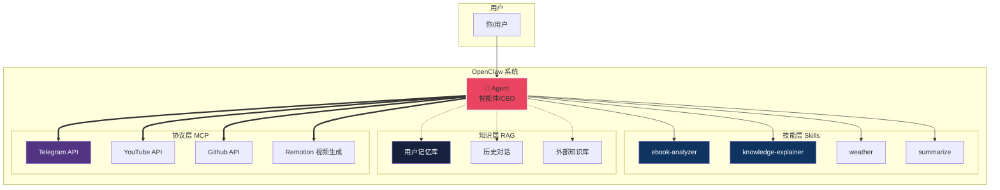

# 🎯 AI 四剑客完整对比图

## 一句话总结
> **Agent=CEO(决策)**, **Skill=工具 (执行)**, **RAG=资料库 (依据)**, **MCP=翻译官 (连接)**

---

## 🗺️ 关系架构图



---

## 📊 四维对比矩阵

| 维度 | Agent | Skill | RAG | MCP |
|:---:|:---:|:---:|:---:|:---:|
| **角色** | 🧠 CEO/大脑 | 🧰 工具箱 | 📚 图书馆 | 🌉 翻译官 |
| **自主性** | ⭐⭐⭐⭐⭐ 完全自主 | ⭐ 被动调用 | ⭐ 辅助功能 | ⭐ 协议标准 |
| **可复用** | ⭐⭐ 部分配置 | ⭐⭐⭐⭐⭐ 完全复用 | ⭐⭐⭐⭐ 知识库共享 | ⭐⭐⭐⭐⭐ 标准接口 |
| **需要连接** | ❌ 可离线 | ❌ 本地运行 | ⚠️ 需知识库 | ✅ 需网络 |
| **谁调用** | 用户 → Agent | Agent → Skill | LLM → RAG | System ↔ External |
| **典型场景** | "帮我分析书" | 文本分析/解释 | 查资料回答 | API 连接/数据同步 |

---

## 🔄 工作流可视化

```
┌──────────────────────────────────────────────────────┐
│           用户输入："帮我分析这本书并生成视频"        │
└───────────────────┬──────────────────────────────────┘
                    │
    ┌───────────────▼──────────────────┐
    │ 🤖 Agent (主控决策中心)            │
    │ • 理解需求                        │
    │ • 拆解任务步骤                    │
    │ • 选择合适工具                    │
    └───────────┬───────────────────────┘
                │
        ┌───────┴───────┐
        ▼               ▼
┌─────────────┐  ┌─────────────┐
│ 🧰 Skills   │  │ 📚 RAG      │
│ • 读文件    │  │ • 查历史笔记│
│ • 分析内容  │  │ • 找模板    │
│ • 生成解释  │  │ • 个性化    │
└──────┬──────┘  └────┬────────┘
       │              │
       └──────┬───────┘
              ▼
      ┌─────────────┐
      │ 🌉 MCP      │
      │ • Remotion  │
      │ • YouTube   │
      │ • Telegram  │
      └──────┬──────┘
             ▼
    ┌─────────────────┐
    │   ✅ 最终输出   │
    │ • 文字笔记      │
    │ • 漫画插图      │
    │ • 语音解说      │
    │ • 60 秒视频      │
    │ • 资源链接      │
    └─────────────────┘
```

---

## 🎯 生活类比对照表

### 🏠 家庭场景
| 概念 | 家庭成员 | 职责 |
|:---:|:---:|:---|
| **Agent** | 👨‍👩‍👧‍👦 **家长/管理者** | "今天要做蛋糕，先买材料再烤" → 规划全流程 |
| **Skill** | 🛠️ **厨房工具** | 烤箱/打蛋器/秤 → 被用来做具体事情 |
| **RAG** | 📖 **菜谱书** | 不熟悉的菜→查书找做法 → 提供依据 |
| **MCP** | 📞 **外卖电话线** | 家里和餐厅之间的标准通信方式 |

### 🏢 公司场景
| 概念 | 公司角色 | 工作流 |
|:---:|:---:|:---|
| **Agent** | 👨‍💼 **项目经理** | 接收需求 → 分配任务 → 跟进进度 |
| **Skill** | 🧰 **部门技能包** | 设计/开发/市场各团队的专业能力 |
| **RAG** | 📁 **公司知识库** | 过往项目经验/文档/最佳实践 |
| **MCP** | 🔌 **标准接口** | 与其他公司系统对接的统一协议 |

---

## 💡 核心区别速查卡

```
┌─────────────────┬─────────────────┬──────────────────┬──────────────────┐
│     Agent       │      Skill      │        RAG       │       MCP        │
├─────────────────┼─────────────────┼──────────────────┼──────────────────┤
│  "我能决定做什么"│ "我能被用来做什么"│ "我有依据回答"    │ "我能连接外部"   │
├─────────────────┼─────────────────┼──────────────────┼──────────────────┤
│ 能理解模糊指令   │ 功能单一明确     │ 检索 + 生成         │ 双向转换         │
│ 自主决策执行     │ 可被复用         │ 减少幻觉          │ 统一标准         │
│ 处理异常情况     │ 参数化配置       │ 私有知识利用      │ 扩展性强         │
└─────────────────┴─────────────────┴──────────────────┴──────────────────┘

记忆口诀:
Agent 是 CEO,能想能做;
Skill 是工具，被用来用;
RAG 查资料，回答靠谱;
MCP 搭桥梁，连接万物。
```

---

## 🎨 颜色编码系统

| 概念 | 主色 | 用途 |
|:---:|:---:|:---|
| **Agent** | `#e94560` 红色 | 决策/控制核心 |
| **Skill** | `#0f3460` 深蓝 | 工具/功能模块 |
| **RAG** | `#16213e` 暗黑蓝 | 知识/资料存储 |
| **MCP** | `#533483` 紫色 | 连接/协议标准 |

---

## 📈 能力雷达图（文字版）

```
         自主决策力
             ▲
            / \
           /   \
    复用性 /-----\ 扩展性
          / Agent \
         /---------\
        / RAG-MCP   \
       /-------------\
      Skill          专业深度
```

**解读:**
- **Agent**: 自主决策最强，但复用性中等
- **Skill**: 复用性极强，专业性高
- **RAG**: 平衡型（知识+AI）
- **MCP**: 扩展性最强，连接万物

---

## 🚀 实战应用对照

| 任务 | Agent 作用 | Skill 选择 | RAG 增强 | MCP 连接 |
|:---|:---|:---|:---|:---|
| **分析电子书** | 理解→规划步骤 | ebook-analyzer | 查你的读书偏好 | Google Drive 存储 |
| **生成解释视频** | 设计脚本结构 | knowledge-explainer | 参考优质教程 | Remotion API 渲染 |
| **监控天气预警** | 设定阈值检查 | weather skill | 历史灾害数据 | Telegram 发消息 |
| **代码生成+调试** | 理解需求写代码 | coding tools | 查最佳实践 | GitHub 仓库同步 |

---

## 📝 总结：四剑客缺一不可

```
┌─────────────────────────────┐
│                             │
│     OpenClaw 完整生态        │
│                             │
│   Agent (大脑) ←→ Skill    │
│      ↓              ↑       │
│   MCP (连接) ←→ RAG        │
│                             │
│   = 完整智能系统 =          │
│                             │
└─────────────────────────────┘
```

**没有 Agent**: 系统无法自主理解需求  
**没有 Skill**: Agent 无法执行具体任务  
**没有 RAG**: 回答缺乏依据和个性化  
**没有 MCP**: 无法连接外部世界  

---

*由 Knowledge Explainer v3.0 生成 | 2026-03-09* 🎯
